Of course. Here are several diagrams that visually represent the key components and workflows of your enterprise-grade Telegram bot project.

---

### **1. High-Level System Architecture**

This diagram provides a bird's-eye view of your entire system. It shows how the end-user on Telegram, your bot application hosted on Railway, the PostgreSQL database, and the Stripe API all interact. The bot application is the central orchestrator.

```mermaid
graph TD
    subgraph "Cloud Services"
        U[👤 User on Telegram App]
        S[💳 Stripe API]
        T[🌐 Telegram API]
    end

    subgraph "Hosting Platform (e.g., Railway)"
        B(🤖 Bot Application<br>Python / Webhook Server)
        DB[(🗄️ PostgreSQL Database)]
        C(⚙️ Cache Layer)
    end

    U -- Interacts with --> T
    T -- Webhook (User Message) --> B
    B -- API Call (Send Reply) --> T
    B <--> DB
    B <--> C
    B -- API Call (Create Checkout) --> S
    S -- Webhook (Payment Status) --> B
```

---

### **2. User Onboarding and Purchase Flow**

This flowchart illustrates the journey a **new user** takes from first interacting with the bot to successfully purchasing credits and sending their first message.

```mermaid
graph TD
    A[User sends /start to the Bot] --> B{Welcome Message}
    B --> C[User clicks '▶️ Start' button]
    C --> D[Bot displays available product packages]
    D --> E{User selects a product}
    E --> F[Bot generates and sends a Stripe Checkout link]
    F --> G[User completes payment on Stripe]
    G --> H(Stripe sends 'checkout.session.completed' webhook)
    H --> I[Bot's Webhook Server validates event]
    I --> J[Bot updates user's credits in Database]
    J --> K[Bot sends confirmation message to User]
    K --> L[User can now send messages]
```

### **3. Topic-Based Conversation Management Flow**

This is the core of your admin experience. This diagram shows the two-way communication bridge between a user's private chat and their dedicated thread in the admin group.

```mermaid
sequenceDiagram
    participant U as 👤 User (Private Chat)
    participant B as 🤖 Bot Logic
    participant A as 🧑‍💼 Admin (Admin Group Topic)

    U->>B: Sends a message ("Hello!")
    B->>B: Check if user has a topic in DB
    Note over B: No topic found. Create one.
    B->>A: Creates new Topic: "👤 username (12345)"
    B->>A: Pins User Info Card to the new topic
    B->>A: Forwards User's message ("Hello!") to topic

    A->>B: Admin replies inside the topic ("Hi there!")
    B->>B: Get user_id associated with this topic_id from DB
    B->>U: Forwards Admin's reply ("Hi there!") to User
    A-->>A: Bot reacts with ✅ to Admin's message
```

### **4. Git Branching Strategy (GitFlow-Inspired)**

This diagram visualizes the branching model outlined in your documentation, ensuring organized and safe development. `main` is for production, `development` is for integration, and `feature` branches are for new work.
Here is your **Git Branching Strategy (GitFlow-Inspired)** diagram as a Mermaid `gitGraph`, ready to paste into your Obsidian note:

### **5. Database Entity-Relationship Diagram (ERD)**

This ERD visually represents your PostgreSQL schema. It shows the tables and the relationships between them, such as how a `user` can have a `conversation` record and multiple `transactions`.

Here is your **Database Entity-Relationship Diagram (ERD)** in Mermaid format, ready to use in your Obsidian note:

