Of course. Here is a consolidated and structured guide that combines all your selected features into a single, coherent blueprint. This version integrates the dynamic settings, admin controls, and advanced features directly into the core bot code.

The most efficient stack is **Python** with the **`python-telegram-bot`** library, a **PostgreSQL** database, **Stripe** for payments, and **Railway** for hosting.

-----

### \#\# Architecture Diagram

Here is the data flow for your service. The bot acts as the central coordinator.

```mermaid
sequenceDiagram
    participant User as 👤 Fan
    participant Bot as 🤖 Telegram Bot
    participant Stripe as 💳 Payment Processor
    participant DB as 🗄️ Database

    User->>+Bot: Sends /start
    Bot->>+DB: Get welcome_message & products
    DB-->>-Bot: Return settings
    Bot-->>-User: Welcome! Choose a plan (buttons).
    User->>+Bot: Selects product
    Bot->>+DB: Get product details (Stripe Price ID)
    DB-->>-Bot: Return price_id
    Bot->>+Stripe: Create Checkout Session
    Stripe-->>-Bot: Returns payment_url
    Bot-->>-User: Here's your payment link: [url]
    User->>+Stripe: Clicks link and pays
    Stripe->>+Bot: Sends 'payment successful' webhook
    Bot->>+DB: UPDATE users SET credits = credits + amount WHERE user_id = ...
    DB-->>-Bot: Confirms update
    Bot-->>-User: Thanks! Your credits are added.
    User->>+Bot: Sends a message (text/photo)
    Bot->>+DB: Check credits & get message cost
    DB-->>-Bot: User has enough credits (cost=3)
    Bot->>Bot: Forward message to you (admin)
    Bot->>DB: UPDATE users SET credits = credits - 3
```



-----

### \#\# 1. Complete Database Schema

First, set up your PostgreSQL database with the following tables. This schema supports dynamic settings, multiple product offerings, and user credit management.

```sql
-- Stores user information and their credit/time balances
CREATE TABLE users (
    telegram_id BIGINT PRIMARY KEY,
    username VARCHAR(255),
    message_credits INT DEFAULT 0,
    time_credits_seconds INT DEFAULT 0
);

-- A key-value store for all configurable bot settings
CREATE TABLE bot_settings (
    setting_key VARCHAR(50) PRIMARY KEY,
    setting_value TEXT NOT NULL
);

-- Initial default settings
INSERT INTO bot_settings (setting_key, setting_value) VALUES
('welcome_message', '👋 Welcome! Buy credits or book a time slot to message me directly.'),
('cost_text_message', '1'),
('cost_photo_message', '3'),
('cost_voice_message', '5');

-- Stores the products you sell (credit packs, time blocks)
CREATE TABLE products (
    id SERIAL PRIMARY KEY,
    label VARCHAR(100) NOT NULL,            -- e.g., "$10 for 20 Messages"
    stripe_price_id VARCHAR(100) NOT NULL,  -- The ID from your Stripe dashboard (price_...)
    item_type VARCHAR(20) NOT NULL,         -- 'credits' or 'time'
    amount INT NOT NULL,                    -- Number of credits or minutes
    is_active BOOLEAN DEFAULT TRUE
);

-- Initial products (replace with your actual Stripe Price IDs)
INSERT INTO products (label, stripe_price_id, item_type, amount, is_active) VALUES
('$10 for 20 Messages', 'price_YOUR_STRIPE_ID_1', 'credits', 20, TRUE),
('30-Minute Timed Chat', 'price_YOUR_STRIPE_ID_2', 'time', 30, TRUE);
```

-----

### \#\# 2. The Complete `bot.py` Code

This single file contains all the logic for bot initialization, the admin settings panel, dynamic message handling, and direct replies.

```python
import os
import logging
import psycopg2
import stripe
from telegram import Update, InlineKeyboardButton, InlineKeyboardMarkup
from telegram.ext import (
    Application,
    CommandHandler,
    MessageHandler,
    ContextTypes,
    CallbackQueryHandler,
    ConversationHandler,
    filters,
)

# --- Configuration ---
TELEGRAM_TOKEN = os.environ.get("TELEGRAM_TOKEN")
STRIPE_API_KEY = os.environ.get("STRIPE_API_KEY")
DATABASE_URL = os.environ.get("DATABASE_URL")
ADMIN_CHAT_ID = os.environ.get("ADMIN_CHAT_ID") # Your personal Telegram chat ID

# --- Logging ---
logging.basicConfig(format="%(asctime)s - %(name)s - %(levelname)s - %(message)s", level=logging.INFO)

# --- Conversation States for Admin Panel ---
EDIT_WELCOME, EDIT_COST_TEXT, EDIT_COST_PHOTO = range(3)

# --- Database Helper Functions ---
def get_db_conn():
    return psycopg2.connect(DATABASE_URL)

def get_setting(key: str) -> str:
    """Fetches a specific setting from the bot_settings table."""
    # Add your DB logic here
    pass

def set_setting(key: str, value: str):
    """Updates a specific setting."""
    # Add your DB logic here
    pass

def get_user_credits(user_id: int) -> int:
    """Fetches user credits, creating the user if they don't exist."""
    # Add your DB logic here
    pass

def get_active_products() -> list:
    """Fetches all active products to display as buttons."""
    # Add your DB logic here to return a list of tuples: (id, label)
    pass

def decrement_user_credits(user_id: int, cost: int) -> int:
    """Decrements user credits by a specific cost."""
    # Add your DB logic here
    pass

# --- Admin Settings Panel (/settings) ---

async def settings_command(update: Update, context: ContextTypes.DEFAULT_TYPE):
    """Shows the main settings menu to the admin."""
    if str(update.effective_user.id) != ADMIN_CHAT_ID:
        return
    keyboard = [
        [InlineKeyboardButton("📝 Edit Welcome Message", callback_data="edit_welcome")],
        [InlineKeyboardButton("💰 Edit Message Costs", callback_data="edit_costs")],
    ]
    await update.message.reply_text("⚙️ Admin Settings", reply_markup=InlineKeyboardMarkup(keyboard))
    return 'SETTINGS_MENU'

async def ask_for_new_welcome_message(update: Update, context: ContextTypes.DEFAULT_TYPE):
    query = update.callback_query
    await query.answer()
    await query.edit_message_text("Please send the new welcome message text.")
    return EDIT_WELCOME

async def save_new_welcome_message(update: Update, context: ContextTypes.DEFAULT_TYPE):
    set_setting('welcome_message', update.message.text)
    await update.message.reply_text("✅ Welcome message updated successfully!")
    return ConversationHandler.END

# ... (Add more functions for editing costs similarly) ...

async def cancel_conversation(update: Update, context: ContextTypes.DEFAULT_TYPE):
    await update.message.reply_text("Operation cancelled.")
    return ConversationHandler.END


# --- User-Facing Handlers ---

async def start(update: Update, context: ContextTypes.DEFAULT_TYPE):
    """Handles the /start command with dynamic content."""
    welcome_msg = get_setting('welcome_message')
    products = get_active_products()
    keyboard = [[InlineKeyboardButton(label, callback_data=f"buy_{pid}")] for pid, label in products]
    await update.message.reply_text(welcome_msg, reply_markup=InlineKeyboardMarkup(keyboard))

async def button_handler(update: Update, context: ContextTypes.DEFAULT_TYPE):
    """Handles all button clicks, including dynamic product purchases."""
    query = update.callback_query
    await query.answer()
    
    if query.data.startswith("buy_"):
        product_id = int(query.data.split("_")[1])
        # 1. Fetch product details (stripe_price_id) from DB using product_id
        # 2. Create Stripe Checkout session
        # 3. Send link to user
        pass

# --- Master Message Handling Logic ---

async def master_message_handler(update: Update, context: ContextTypes.DEFAULT_TYPE):
    """A single handler to route admin replies and user messages."""
    user = update.effective_user
    chat_id = update.effective_chat.id

    # 1. Route admin replies
    if str(chat_id) == ADMIN_CHAT_ID and update.message.reply_to_message and update.message.reply_to_message.forward_from:
        original_user_id = update.message.reply_to_message.forward_from.id
        try:
            await context.bot.send_message(chat_id=original_user_id, text=f"💬 A reply from me:\n\n{update.message.text}")
            await update.message.reply_text("✅ Reply sent!")
        except Exception as e:
            await update.message.reply_text(f"❌ Failed to send reply: {e}")
        return

    # 2. Route regular user messages (text, photo, etc.)
    cost = 0
    message_type = "unknown"
    if update.message.text:
        cost = int(get_setting('cost_text_message'))
        message_type = "text message"
    elif update.message.photo:
        cost = int(get_setting('cost_photo_message'))
        message_type = "photo"
    elif update.message.voice:
        cost = int(get_setting('cost_voice_message'))
        message_type = "voice message"
    
    if cost == 0: return # Ignore non-billable message types

    # 3. Check credits and process
    user_id = user.id
    credits = get_user_credits(user_id)
    if credits >= cost:
        new_credits = decrement_user_credits(user_id, cost)
        await context.bot.forward_message(chat_id=ADMIN_CHAT_ID, from_chat_id=user_id, message_id=update.message.message_id)
        await update.message.reply_text(f"Message sent! ({cost} credits used). You have {new_credits} credits left.")
    else:
        await update.message.reply_text(f"You don't have enough credits for a {message_type} (costs {cost}). Your balance is {credits}. Please use /start to buy more.")


def main() -> None:
    application = Application.builder().token(TELEGRAM_TOKEN).build()

    # Admin Settings Conversation Handler
    settings_handler = ConversationHandler(
        entry_points=[CommandHandler("settings", settings_command)],
        states={
            'SETTINGS_MENU': [CallbackQueryHandler(ask_for_new_welcome_message, pattern="^edit_welcome$")],
            EDIT_WELCOME: [MessageHandler(filters.TEXT & ~filters.COMMAND, save_new_welcome_message)],
        },
        fallbacks=[CommandHandler("cancel", cancel_conversation)],
    )

    application.add_handler(settings_handler)
    application.add_handler(CommandHandler("start", start))
    application.add_handler(CallbackQueryHandler(button_handler))
    
    # Add the single, powerful message handler for all message types
    all_message_filters = filters.TEXT | filters.PHOTO | filters.VOICE
    application.add_handler(MessageHandler(all_message_filters & ~filters.COMMAND, master_message_handler))

    logging.info("Bot is running...")
    application.run_polling()

if __name__ == "__main__":
    main()
```

-----

### \#\# 3. Launch & Operations Checklist

#### **✅ Legal & Security**

  * **ToS/Privacy:** Create `/terms` and `/privacy` commands that link to public pages with your policies.
  * **Environment Variables:** **Never** hardcode API keys. Use `os.environ.get()` for all secrets.
  * **Webhook Secrets:** Secure your payment webhook endpoint by verifying Stripe's signature on every request.

#### **🧪 Testing**

  * **Stripe Test Mode:** Use test keys and [test card numbers](https://stripe.com/docs/testing) to simulate payments without real transactions.
  * **Stripe CLI:** Use `stripe listen --forward-to <your_webhook_url>` to test webhook handling locally.
  * **Beta Testers:** Have friends test the full flow: purchase, message, get a reply, run out of credits.

#### **⚙️ Monitoring**

  * **Logging:** Your hosting service (Railway/Render) will capture all output from the `logging` module. Check these logs for errors.
  * **Error Alerts:** Wrap critical functions (like payment processing) in `try...except` blocks that send you a Telegram message if an error occurs.

-----

### \#\# 4. Future Enhancements

Once your bot is live, consider these next-level improvements:

  * **👑 Admin Dashboard:** Build a simple web interface with **Streamlit** or **Flask** to view users, transactions, and analytics without needing to query the database manually.
  * **🗓️ Automated Calendar Integration:** Use the **Google Calendar API** to fully automate the booking of time-based sessions, preventing double-bookings.
  * **⚙️ Message Queues:** For high reliability, use a service like **Redis** to queue incoming messages and payment webhooks. This ensures no data is lost if your bot temporarily crashes.