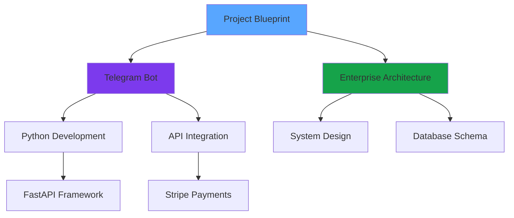

# <div class="header-icon technology"><i class="material-symbols-outlined">rocket_launch</i></div>Advanced Features

<div class="page-header" markdown>
Powerful web-based tools for content creation, AI assistance, and seamless Obsidian integration.
</div>

---

## <div class="header-icon projects"><i class="material-symbols-outlined">edit_note</i></div>Advanced Markdown Editor

Transform your web browser into a powerful content creation environment with our Monaco-powered editor.

### ✨ **Key Features**

<div class="feature-grid" markdown>

<div class="feature-card editor" markdown>
<div class="feature-icon">🎨</div>
<div class="feature-content">
<div class="feature-title">Monaco Editor Integration</div>
<div class="feature-description">Full VS Code-like editing experience with syntax highlighting, auto-completion, and advanced keybindings</div>
</div>
</div>

<div class="feature-card editor" markdown>
<div class="feature-icon">👁️</div>
<div class="feature-content">
<div class="feature-title">Live Preview</div>
<div class="feature-description">Split-screen live preview with real-time markdown rendering and synchronized scrolling</div>
</div>
</div>

<div class="feature-card editor" markdown>
<div class="feature-icon">💾</div>
<div class="feature-content">
<div class="feature-title">Auto-Save</div>
<div class="feature-description">Intelligent auto-save with conflict detection and version history</div>
</div>
</div>

</div>

### ⌨️ **Keyboard Shortcuts**

| Shortcut | Action |
|----------|--------|
| `Ctrl+Shift+E` | Open Advanced Editor |
| `Ctrl+S` | Save to Obsidian |
| `Ctrl+Shift+P` | Toggle Preview |
| `Ctrl+Shift+A` | Toggle AI Assistant |
| `Esc` | Close Editor |

---

## <div class="header-icon architecture"><i class="material-symbols-outlined">sync</i></div>Obsidian Integration

Seamlessly connect your web editor to your local Obsidian vault for true bidirectional editing.

### 🔄 **Bidirectional Sync**

<div class="sync-flow" markdown>

<div class="sync-step" markdown>
<div class="sync-icon">1</div>
<div class="sync-content">
<div class="sync-title">Edit on Web</div>
<div class="sync-description">Make changes using the advanced web editor</div>
</div>
</div>

<div class="sync-arrow">→</div>

<div class="sync-step" markdown>
<div class="sync-icon">2</div>
<div class="sync-content">
<div class="sync-title">Auto-Sync</div>
<div class="sync-description">Changes automatically sync to your Obsidian vault</div>
</div>
</div>

<div class="sync-arrow">→</div>

<div class="sync-step" markdown>
<div class="sync-icon">3</div>
<div class="sync-content">
<div class="sync-title">Live Updates</div>
<div class="sync-description">See changes reflected in Obsidian immediately</div>
</div>
</div>

</div>

### 🔧 **Setup Requirements**

1. **Install Obsidian Local REST API Plugin**
   ```
   Community Plugin: obsidian-local-rest-api
   ```

2. **Configure API Access**
   ```javascript
   API Endpoint: http://localhost:27123
   Authentication: Bearer token
   ```

3. **Enable CORS**
   ```
   Allow web app access to local API
   ```

---

## <div class="header-icon categories"><i class="material-symbols-outlined">smart_toy</i></div>AI-Powered Assistant

Integrate ChatGPT, Claude, or other LLMs directly into your editing workflow for intelligent content assistance.

### 🤖 **AI Capabilities**

<div class="ai-features" markdown>

<div class="ai-feature-card organize" markdown>
<div class="ai-feature-icon">🏗️</div>
<div class="ai-feature-title">Content Organization</div>
<div class="ai-feature-description">
- Auto-structure your notes with proper headings
- Suggest optimal content flow and hierarchy
- Generate table of contents and section breaks
</div>
</div>

<div class="ai-feature-card enhance" markdown>
<div class="ai-feature-icon">✨</div>
<div class="ai-feature-title">Content Enhancement</div>
<div class="ai-feature-description">
- Improve writing clarity and style
- Suggest relevant examples and links
- Grammar and spelling corrections
</div>
</div>

<div class="ai-feature-card tags" markdown>
<div class="ai-feature-icon">🏷️</div>
<div class="ai-feature-title">Smart Tagging</div>
<div class="ai-feature-description">
- Analyze content for relevant tags
- Suggest category classifications
- Auto-generate frontmatter metadata
</div>
</div>

<div class="ai-feature-card links" markdown>
<div class="ai-feature-icon">🔗</div>
<div class="ai-feature-title">Connection Discovery</div>
<div class="ai-feature-description">
- Identify relationships with existing notes
- Suggest backlink opportunities
- Generate knowledge graph connections
</div>
</div>

</div>

### 💬 **AI Prompt Examples**

!!! example "Organization Prompts"
    - "Help organize this note with clear sections"
    - "Generate a table of contents for this content"
    - "Suggest better headings and structure"

!!! example "Enhancement Prompts"
    - "Improve the clarity of this explanation"
    - "Add relevant examples to this concept"
    - "Make this more engaging and readable"

!!! example "Tagging Prompts"
    - "Suggest relevant tags for this note"
    - "Categorize this content appropriately"
    - "Generate frontmatter metadata"

---

## <div class="header-icon technology"><i class="material-symbols-outlined">hub</i></div>Smart Content Management

Advanced features for organizing, discovering, and connecting your content.

### 🕸️ **Knowledge Graph Visualization**

<div class="knowledge-graph-demo" markdown>



</div>

### 📊 **Content Analytics**

<div class="analytics-grid" markdown>

<div class="analytics-card" markdown>
<div class="analytics-title">Content Statistics</div>
<div class="analytics-value">247</div>
<div class="analytics-label">Total Notes</div>
</div>

<div class="analytics-card" markdown>
<div class="analytics-title">Connection Density</div>
<div class="analytics-value">89%</div>
<div class="analytics-label">Linked Content</div>
</div>

<div class="analytics-card" markdown>
<div class="analytics-title">AI Assistance</div>
<div class="analytics-value">156</div>
<div class="analytics-label">Improvements Made</div>
</div>

<div class="analytics-card" markdown>
<div class="analytics-title">Sync Status</div>
<div class="analytics-value">✅</div>
<div class="analytics-label">Connected</div>
</div>

</div>

---

## <div class="header-icon phases"><i class="material-symbols-outlined">settings</i></div>Implementation Roadmap

### **Phase 1: Core Editor** ✅
- [x] Monaco Editor Integration
- [x] Live Preview
- [x] Basic Auto-Save
- [x] Keyboard Shortcuts

### **Phase 2: Obsidian Sync** 🚧
- [x] Local REST API Integration
- [ ] File Tree Browser
- [ ] Conflict Resolution
- [ ] Real-time Collaboration

### **Phase 3: AI Assistant** 🚧
- [x] Basic AI Chat Interface
- [ ] Content Analysis
- [ ] Smart Suggestions
- [ ] Auto-tagging

### **Phase 4: Advanced Features** 📋
- [ ] Knowledge Graph Visualization
- [ ] Advanced Analytics
- [ ] Plugin System
- [ ] Mobile App

---

## <div class="header-icon links"><i class="material-symbols-outlined">play_circle</i></div>Getting Started

### 🚀 **Try the Advanced Editor**

1. **Click the "Advanced Editor" button** in the top toolbar
2. **Start writing** your content with full syntax highlighting
3. **Use AI assistance** to enhance and organize your notes
4. **Save directly** to your Obsidian vault

### 🔗 **Quick Access**

<div class="quick-access-buttons" markdown>

[:material-edit: Open Advanced Editor](#){ .feature-btn .primary onclick="openAdvancedEditor()" }
[:material-search: Advanced Search](#){ .feature-btn .secondary onclick="openAdvancedSearch()" }
[:material-bookmark: Bookmarks](#){ .feature-btn .tertiary onclick="toggleBookmark()" }

</div>

---

## <div class="header-icon metrics"><i class="material-symbols-outlined">feedback</i></div>Feedback & Development

This is an active development project! We're continuously adding new features and improvements.

### 💡 **Upcoming Features**

- **Real-time collaboration** with other users
- **Voice-to-text** note creation
- **Advanced plugin system** for custom workflows
- **Mobile companion app** for on-the-go editing
- **Integration with other tools** (Notion, Roam, etc.)

### 🐛 **Report Issues**

Found a bug or have a feature request? Let us know!

- **GitHub Issues**: [Report here](https://github.com/dsosaa/overwrked-public/issues)
- **Feature Requests**: Use the AI assistant to suggest improvements
- **Community**: Join our discussions for tips and tricks

---

!!! tip "Pro Tip"
    Use `Ctrl+Shift+E` anywhere on the site to quickly open the advanced editor and start creating content!
